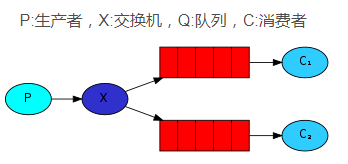

### 记录
```angular2html
# 登录
http://localhost:15672/#/
#用户名 guest
#密码 guest
```


### 介绍


-----
>  rabbitmq的六种工作模式：

1. simple简单模式
   * 一个队列一个消费者
   *  消费者监听消息队列，消息队列中有消息就消费掉，消息队列中数据也会清除
    
2. work工作模式
   * 一个队列多个消费者
   * c1和c2共同监听一个消息队列，但是一个消息只能被一个消费者消费
    
3. publish/subscribe发布订阅模式
   * 生产者将消息不是直接发送到队列，而是发送到交换机，没有路由规则
   * 然后由交换机发送给两个队列，两个消费者各自监听一个队列，来消费消息
      
4. routing路由模式
    * 消息生产者将消息发送给交换机按照路由判断
    * 交换机根据路由的key,只能匹配上路由key对应的消息队列,对应的消费者才能消费消息
      
5. topic 主题模式(模糊的路由规则)
    * 消息产生者产生消息后把消息交给交换机
    * 交换机根据key的规则模糊匹配到对应的队列,由队列的监听消费者接收消息消费
      
6.  RPC(远程过程调用)模式
   * RPC模式与 work工作模式差不多（都不需要交换器、都需要指定唯一的消息队列进行消息传递） 
   * RPC模式是一个回环结构，客户端C先发送消息到消息队列 *
   * 远程服务端S获取消息，然后再写入另一个消息队列，向原始客户端 Client 响应消息处理结果
     

### rabbitmq 使用

```
# 基本操作（简单模式）
send.php 生产消息
consume.php  消费消息
```

 开启两个终端，分别执行 php send.php; php sonsume.php;
