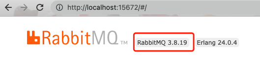
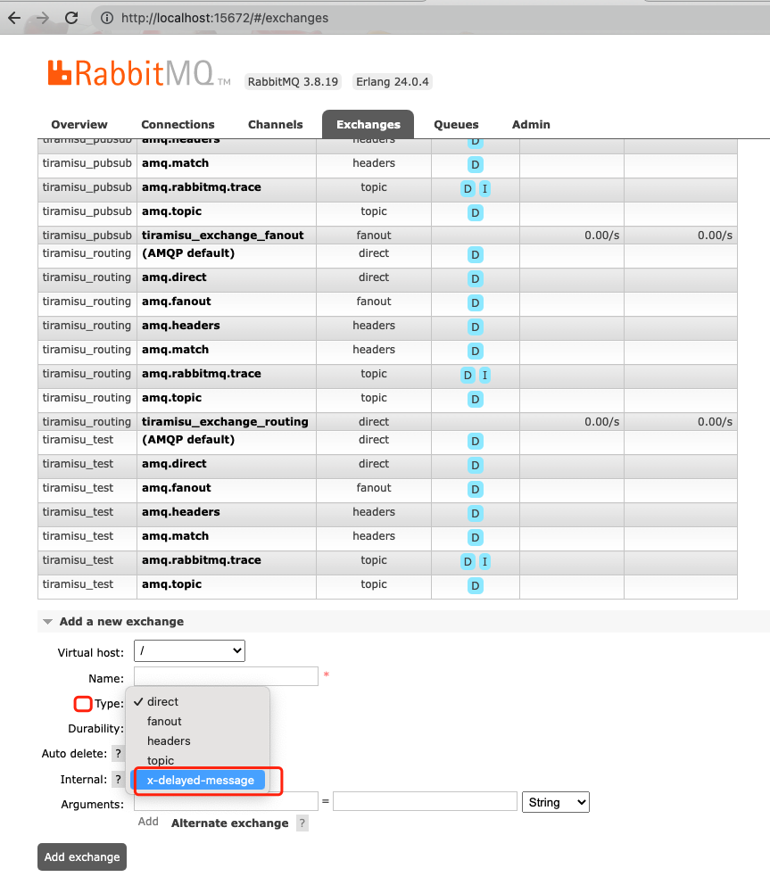

### 延迟接受消息
 
  安装rabbitmq的插件  
  `rabbitmq-delayed-message-exchange` 插件官方下载地址 [https://github.com/rabbitmq/rabbitmq-delayed-message-exchange/releases](https://github.com/rabbitmq/rabbitmq-delayed-message-exchange/releases)  

  查看rabbitmq的版本  
    

  找到 `rabbitmq` 的安装路径，将下载的插件放到 `plugins` 目录中
  
  然后启用插件  
  命令 `rabbitmq-plugins enable rabbitmq_delayed_message_exchange` 启动插件
  
查看交换机里的 `type` 是否有 `x-delayed-message` 下拉选项，如果有则表示插件安装已经生效了

### 使用
```angular2html
php send.php #生产者
php consume.php #消费者
```