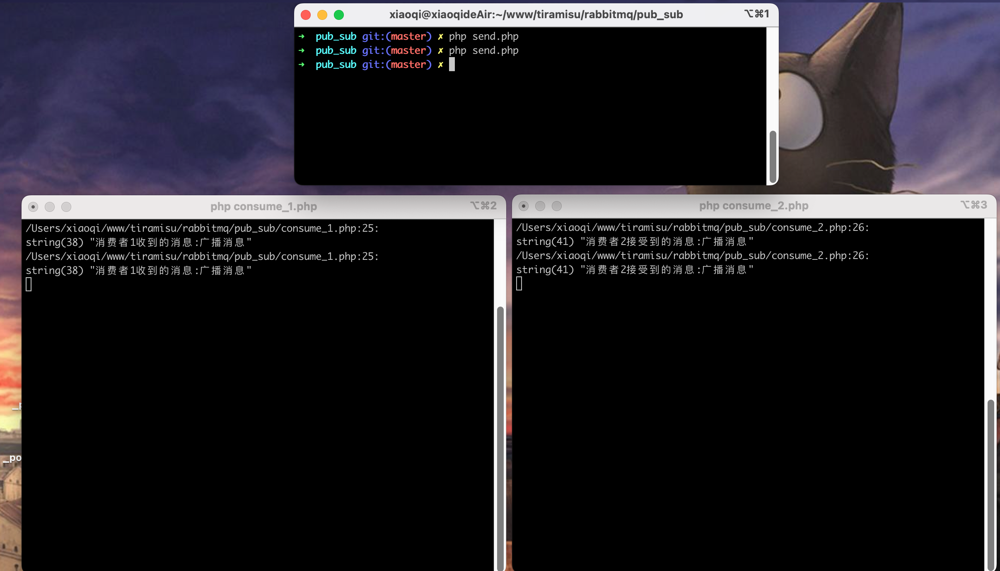

### 发布订阅模式

图示


---

x代表交换机，会把消息发送给绑定的队列中，和广播一样，队列中的消息一摸一样  

该php文件使用的是模式  fanout(广播)

### 生产者

```angular2html
生产者p只与交换机x进行通信，不再和队列关联
代码: send.php
```

### 消费者
```angular2html
消费者c是和队列关联，需要在消费者中指明交换机，并创建队列，并将队列绑定到交换机上
代码: consume_1.php;consume_2.php
```

```angular2html
该模式下生产者的同一个消息可以被不同的消费者使用
```

